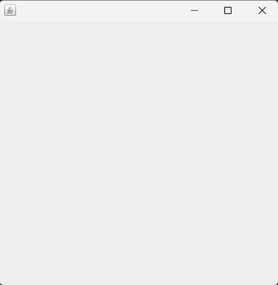

# Part 1: Your First Window

## Introduction

When you use applications like a calculator, a text editor, or a file manager on your computer, you are interacting with a **graphical user interface** (GUI). These applications have windows, buttons, text fields, and menus that you can click and type into.

Java Swing is a library that lets you build these kinds of desktop applications using Java. It provides ready-made components such as windows, buttons, labels, and text fields that you can assemble into a working interface.

In this first part, we focus on the most fundamental piece: the **window** itself. Before you can place any buttons or text on screen, you need a window to put them in. In Swing, that window is called a `JFrame`.

Think of a Swing `JFrame` as an empty picture frame. On its own, it displays nothing interesting, just a blank space. But once you have the frame, you can start placing things inside it. That is exactly what we will do in the parts that follow.

> **Note:** Swing is part of the Java standard library, so you do not need to install anything extra. If you can run Java, you can use Swing.

---

## What is a Swing JFrame?

A `JFrame` is a class in the `javax.swing` package that represents a window on your screen. It is the top-level container for a Swing application, meaning it is the outermost box that holds everything else.

When you create a Swing `JFrame`, you get a window with a title bar (which includes the minimize, maximize, and close buttons), a content area where you will later place components, and the ability to be resized and moved around by the user.

Every Swing application you build will start with a `JFrame`. It is the foundation.

### Extending JFrame

There are two common approaches to using `JFrame`. You can create an instance of `JFrame` directly, or you can create your own class that **extends** `JFrame`. We will use the second approach throughout this series:

~~~java
public class JavaSwing_01 extends JFrame
{
    // Our class IS a JFrame
    // We inherit all of JFrame's methods
}
~~~

By writing `extends JFrame`, our class inherits everything that `JFrame` can do. This means we can call methods like `this.setSize()`, `this.setTitle()`, and `this.setVisible()` directly, because our class *is* a `JFrame`.

> **Note:** If you are not yet comfortable with inheritance (`extends`), here is the short version: it means our class takes on all the abilities of `JFrame`. We don't have to build a window from scratch. We get one automatically and then configure it to our needs.

---

## Your First Window

Let us write the code to create and display a basic empty window. Read through the full program first, then we will break it down line by line.

~~~java
package javaswing_01;

import javax.swing.JFrame;

public class JavaSwing_01 extends JFrame
{
    // Constructor - set up the window properties here
    public JavaSwing_01()
    {
        this.setSize(400, 400);
        this.setDefaultCloseOperation(JFrame.EXIT_ON_CLOSE);
        this.setVisible(true);
    }

    public static void main(String[] args)
    {
        JavaSwing_01 swing1 = new JavaSwing_01();
    }
}
~~~

When you run this program, a 400 by 400 pixel window appears on your screen. It has a title bar with the standard minimize, maximize, and close buttons, and the content area is completely empty. That is exactly what we want: a blank canvas, ready for components.

  

---

## Understanding the Code

Let us go through each part of the program and understand what it does and why it is there.

### The Package and Import

~~~java
package javaswing_01;

import javax.swing.JFrame;
~~~

The `package` statement declares which package this class belongs to. The `import` statement brings in the `JFrame` class from the `javax.swing` package so that we can use it in our code. Without this import, the compiler would not know what `JFrame` is.

### The Class Declaration

~~~java
public class JavaSwing_01 extends JFrame
{
    ...
}
~~~

We declare our class and use `extends JFrame` to inherit from `JFrame`. This means every instance of `JavaSwing_01` *is* a window. We can call all of `JFrame`'s methods using the `this` keyword.

### The Constructor

The constructor is where we configure our window. It runs automatically when we create a new instance of the class.

~~~java
public JavaSwing_01()
{
    this.setSize(400, 400);
    this.setDefaultCloseOperation(JFrame.EXIT_ON_CLOSE);
    this.setVisible(true);
}
~~~

There are three method calls here, and each one serves a specific purpose:

**`this.setSize(400, 400)`** sets the width and height of the window in pixels. The first number is the width and the second is the height. Without this, the window would appear extremely small and essentially unusable.

**`this.setDefaultCloseOperation(JFrame.EXIT_ON_CLOSE)`** tells Java what should happen when the user clicks the close button (the X) on the window. `JFrame.EXIT_ON_CLOSE` means the entire application should terminate. Without this line, closing the window would hide it, but the program would keep running in the background.

**`this.setVisible(true)`** makes the window appear on screen. A Swing `JFrame` is invisible by default, so without this line, the program would run but you would see nothing. We place this call **last** in the constructor so that the window is fully configured before it becomes visible.

> **Note:** We call `this.setVisible(true)` last on purpose. This ensures that the window size and close behavior are already set before the window appears. In later parts, when we add buttons and labels to the frame, placing `setVisible(true)` last will ensure all components are visible from the moment the window appears.

### The Main Method

~~~java
public static void main(String[] args)
{
    JavaSwing_01 swing1 = new JavaSwing_01();
}
~~~

The `main` method is the entry point of the program. All it does is create a new instance of our class. When `new JavaSwing_01()` executes, the constructor runs, which configures and displays the window. One line is all it takes to launch the application.

---

## Why We Use `this`

Throughout the constructor, we write `this.setSize()`, `this.setDefaultCloseOperation()`, and `this.setVisible()` instead of just `setSize()`, `setDefaultCloseOperation()`, and `setVisible()`. Both forms work, but we use `this` deliberately in this series.

The `this` keyword refers to the current object, the specific instance of `JavaSwing_01` that is being constructed. When you read `this.setSize(400, 400)`, it explicitly says: "set the size of *this* window to 400 by 400."

This becomes especially important later in the series when we work with event listeners and inner classes, where the meaning of `this` can change depending on context. Building the habit of using `this` now will make those situations much easier to understand.

~~~java
// Both lines do the same thing inside the constructor:
this.setSize(400, 400);   // Explicit: "set size of THIS object"
setSize(400, 400);         // Implicit: Java assumes "this"

// We will use the explicit form throughout this series.
~~~

---

## Understanding the Close Operation

The `setDefaultCloseOperation()` method deserves special attention because choosing the wrong option can lead to confusing behavior.

There are four possible values you can pass to this method:

| Constant | What Happens When You Close |
|---|---|
| `JFrame.EXIT_ON_CLOSE` | The entire application terminates. |
| `JFrame.HIDE_ON_CLOSE` | The window is hidden but the program keeps running. This is the *default* if you don't call `setDefaultCloseOperation()`. |
| `JFrame.DISPOSE_ON_CLOSE` | The window is destroyed, but the program keeps running if other windows are still open. |
| `JFrame.DO_NOTHING_ON_CLOSE` | Nothing happens. The close button is effectively disabled. |

For a simple application with a single window, `JFrame.EXIT_ON_CLOSE` is almost always what you want. Without it, you would close the window and wonder why your IDE still shows the program as running.

> **Note:** Try removing the `this.setDefaultCloseOperation(JFrame.EXIT_ON_CLOSE)` line from the code and running the program. Close the window and check your IDE. You will notice the program is still running. You would have to manually stop it. This is a common mistake for beginners.

---

## Practice Exercises

These exercises will help you get comfortable with creating and configuring a Swing `JFrame`.

**Exercise 1.** Type out the complete program from the "Your First Window" section by hand (do not copy-paste). Run it and confirm that a 400 by 400 window appears on your screen.

**Exercise 2.** Modify the window size to 800 by 600. Run the program and observe the difference. Then try 200 by 200. Get a feel for how the numbers relate to the actual window size.

**Exercise 3.** Add the line `this.setTitle("My First Swing App");` to the constructor (before `setVisible`). Run the program and observe where the title appears.

**Exercise 4.** Remove the `this.setDefaultCloseOperation(JFrame.EXIT_ON_CLOSE);` line. Run the program, close the window, and check whether your IDE shows the program as still running. Then add the line back.

**Exercise 5.** Remove the `this.setVisible(true);` line. Run the program and observe what happens. What do you see? Add the line back.

**Exercise 6.** Add the line `this.setResizable(false);` to the constructor. Run the program and try to resize the window by dragging its edges. What happens?

**Exercise 7.** Add the line `this.setLocationRelativeTo(null);` to the constructor (before `setVisible`). Run the program. Where does the window appear now compared to before?

**Exercise 8.** In your own words, explain why we call `this.setVisible(true)` as the last line in the constructor. Why not put it first?

---

*End of Part 1 -- Your First Window*

*Next: [Part 2 -- What Are Components?](02-what-are-components.md)*
