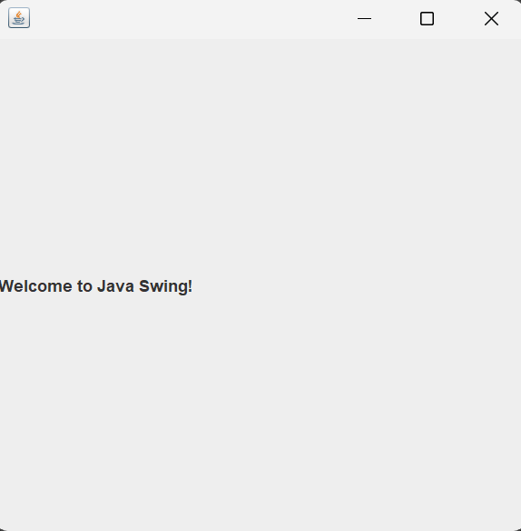

## Part 3: Adding Text with JLabel

## Introduction

In Part 1, you created an empty Swing `JFrame`. In Part 2, you learned that Swing provides ready-made building blocks called components, and that adding a component to a frame follows two steps: create it, then add it.

Now it is time to put that into practice. In this part, you will add your first component to the window. You will use a `JLabel` to display text on the screen. This is the simplest Swing component, and it will be the first time you see something appear inside your frame.

---

## What is a JLabel?

A `JLabel` is a Swing component that displays text or an image on the screen. The user can see it, but cannot click it, type into it, or interact with it in any way. It is purely for display.

Labels are one of the most commonly used components in any GUI. You see them everywhere: next to text fields ("Enter your name:"), as headings ("Welcome to the App"), or as status messages ("File saved successfully").

In Swing, the `JLabel` class lives in the `javax.swing` package, just like `JFrame`.

---

## Adding a JLabel to the Frame

Let us build on the program from Part 1 and add a `JLabel` to our window. Read through the full program first, then we will focus on what is new.

~~~java
package javaswing_03;

import javax.swing.JFrame;
import javax.swing.JLabel;

public class JavaSwing_03 extends JFrame
{
    public JavaSwing_03()
    {
        JLabel label1 = new JLabel("Welcome to Java Swing!");
        this.add(label1);

        this.setSize(400, 400);
        this.setDefaultCloseOperation(JFrame.EXIT_ON_CLOSE);
        this.setVisible(true);
    }

    public static void main(String[] args)
    {
        JavaSwing_03 swing3 = new JavaSwing_03();
    }
}
~~~

When you run this program, the same 400 by 400 window appears, but this time there is text inside it. The words "Welcome to Java Swing!" are displayed in the window.

  

---

## Understanding the New Code

Most of this program is identical to Part 1. We will only focus on what is new.

### The Import

~~~java
import javax.swing.JLabel;
~~~

Just like we imported `JFrame` to use the window, we need to import `JLabel` to use labels. Every Swing component you use needs its own import statement.

### Creating the JLabel

~~~java
JLabel label1 = new JLabel("Welcome to Java Swing!");
~~~

This line creates a new `JLabel` object and stores it in a variable called `label1`. The text you pass inside the parentheses is what will be displayed on the screen. You can change this text to anything you want.

Let us break it down further:

**`JLabel`** is the type. It tells Java that this variable will hold a label component.

**`label1`** is the variable name. You can name it anything meaningful, like `titleLabel`, `messageLabel`, or `greetingLabel`.

**`new JLabel("Welcome to Java Swing!")`** creates a new instance of `JLabel` with the specified text.

### Adding the JLabel to the Frame

~~~java
this.add(label1);
~~~

This is the line that places the label inside the window. The `this.add()` method takes a component and adds it to the frame. Without this line, the label would exist in memory but would never appear on screen.

Remember the two-step pattern from Part 2:

~~~
Step 1: Create the component    ->  JLabel label1 = new JLabel("...");
Step 2: Add it to the frame     ->  this.add(label1);
~~~

This is that pattern in action. You will use `this.add()` for every component you place in a frame.

> **Note:** Notice that we create and add the label **before** calling `this.setVisible(true)`. This is why we place `setVisible(true)` last. The label is already added to the frame by the time the window appears, so the text is visible immediately.

---

## The Order of Code in the Constructor

Our constructor now has a clear structure:

~~~java
public JavaSwing_03()
{
    // 1. Create and add components
    JLabel label1 = new JLabel("Welcome to Java Swing!");
    this.add(label1);

    // 2. Configure the window
    this.setSize(400, 400);
    this.setDefaultCloseOperation(JFrame.EXIT_ON_CLOSE);

    // 3. Make the window visible (always last)
    this.setVisible(true);
}
~~~

This order is intentional and will stay consistent throughout the series:

**First**, create and add your components. This ensures they exist inside the frame before anything is displayed.

**Second**, configure the window properties like size and close behavior.

**Third**, call `this.setVisible(true)` to display everything at once.

Following this order will prevent visual glitches where a window appears empty and then components suddenly pop in.

---

## Changing the Label Text

The text inside a `JLabel` is not permanent. You can set it when you create the label, but you can also change it later using the `setText()` method.

~~~java
JLabel label1 = new JLabel("Welcome to Java Swing!");
this.add(label1);

// Later in the code, you can change the text:
label1.setText("Hello, World!");
~~~

This becomes useful when you want to update what the label says based on user actions, like clicking a button. We will use this in later parts when we learn about event handling.

> **Note:** For now, just know that `setText()` exists. You will see it in action when we start making interactive applications.

---

## Key Takeaways

- A `JLabel` is a Swing component that displays text on the screen. The user cannot interact with it.
- To use `JLabel`, you must import it with `import javax.swing.JLabel;`.
- Adding a component to the frame follows two steps: create it with `new JLabel("text")`, then add it with `this.add()`.
- The `this.add()` method is how you place any component inside a `JFrame`.
- Always create and add components before calling `this.setVisible(true)`.

---

## What's Next

In Part 4, you will add your second component: a `JButton`. You will see a clickable button appear inside your window. It will not do anything when clicked yet, but it will set the stage for making your applications interactive in a later part.

---

## Practice Exercises

These exercises will help you get comfortable with creating and using `JLabel`.

**Exercise 1.** Type out the complete program from the "Adding a JLabel to the Frame" section by hand. Run it and confirm that the text "Welcome to Java Swing!" appears inside the window.

**Exercise 2.** Change the label text to your own name. For example: `new JLabel("My name is Ntlakanipho")`. Run the program and see your name displayed in the window.

**Exercise 3.** Create the label with an empty string: `new JLabel("")`. Run the program. What do you see inside the window? Now change it to a long sentence and observe how the label adjusts.

**Exercise 4.** Remove the `this.add(label1);` line but keep the `JLabel` creation line. Run the program. Does the text appear? Why or why not?

**Exercise 5.** Try creating the label and adding it **after** `this.setVisible(true)`. Run the program. What happens? Does the text appear immediately, or do you notice anything different? Move it back to before `setVisible(true)` when you are done.

**Exercise 6.** Add `this.setTitle("JLabel Demo");` to the constructor. Run the program and observe that you now have both a window title and a label inside the window. Notice that the title and the label are two different things: one is on the title bar, the other is inside the content area.

---

*End of Part 3 -- Adding Text with JLabel*

*Next: [Part 4 -- Adding Buttons with JButton](04-adding-buttons-with-jbutton.md)*
