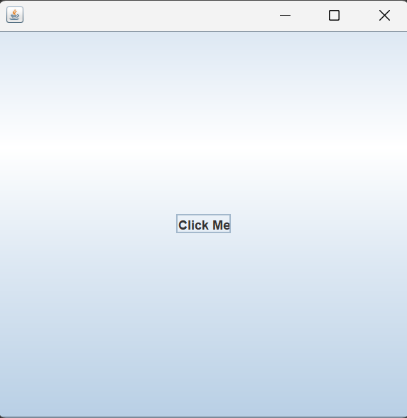

## Part 4: Adding Buttons with JButton

## Introduction

In Part 3, you added your first component to the window. A `JLabel` displayed text on the screen, and you learned the two-step pattern: create the component, then add it with `this.add()`.

Now you will add your second component: a `JButton`. Buttons are one of the most recognizable elements in any application. You click them to submit forms, open files, save documents, and trigger actions. In this part, you will place a button inside your window and see it appear on screen.

There is one important thing to know upfront: the button will not do anything when you click it. Not yet. Making a button respond to clicks requires event handling, which we will cover in a later part. For now, the goal is simply to get a button on screen.

> **Before you begin:** Create a new project in your IDE called `JavaSwing_04`. Make sure your package name is `javaswing_04` and your class name is `JavaSwing_04`. This keeps your project aligned with the code in this lesson.

---

## What is a JButton?

A `JButton` is a Swing component that represents a clickable button. It displays text (or an image) and can be pressed by the user. In a real application, clicking a button triggers some kind of action. For now, we are only concerned with getting the button to appear inside the window.

Like `JLabel`, the `JButton` class lives in the `javax.swing` package and needs to be imported before you can use it.

---

## Adding a JButton to the Frame

Let us add a single button to our window. The structure of this program follows the same pattern you learned in Part 3.

~~~java
package javaswing_04;

import javax.swing.JFrame;
import javax.swing.JButton;

public class JavaSwing_04 extends JFrame
{
    public JavaSwing_04()
    {
        JButton button1 = new JButton("Click Me");
        this.add(button1);

        this.setSize(400, 400);
        this.setDefaultCloseOperation(JFrame.EXIT_ON_CLOSE);
        this.setVisible(true);
    }

    public static void main(String[] args)
    {
        JavaSwing_04 swing4 = new JavaSwing_04();
    }
}
~~~

When you run this program, a 400 by 400 window appears with a large button inside it. The button displays the text "Click Me" and fills the entire content area of the window. You can click it, but nothing will happen.

  

---

## Understanding the New Code

The structure of this program is almost identical to Part 3. The only differences are the import and the type of component we create. Let us look at what is new.

### The Import

~~~java
import javax.swing.JButton;
~~~

We import `JButton` from the `javax.swing` package. Notice the pattern: every new component you use needs its own import. In Part 3, you imported `JLabel`. Now you import `JButton`. The import always follows the format `import javax.swing.ComponentName;`.

### Creating the JButton

~~~java
JButton button1 = new JButton("Click Me");
~~~

This creates a new `JButton` object and stores it in a variable called `button1`. The text you pass inside the parentheses is what appears on the button. You can change this to anything you want, like "Submit", "Save", "OK", or "Press Here".

### Adding the JButton to the Frame

~~~java
this.add(button1);
~~~

This is the exact same `this.add()` method you used in Part 3 for the label. It works the same way for every component. Create it, then add it.

~~~
Step 1: Create the component    ->  JButton button1 = new JButton("Click Me");
Step 2: Add it to the frame     ->  this.add(button1);
~~~

> **Note:** The button fills the entire window because of the default layout manager. When you add a single component to a `JFrame` without setting a layout, it expands to fill the available space. This will make more sense when we discuss layout managers in a later part.

---

## JLabel vs JButton

You now know two Swing components. Let us compare them so the differences are clear.

| Feature | JLabel | JButton |
|---|---|---|
| What it does | Displays text on screen | Displays a clickable button |
| User interaction | None. The user can only look at it. | The user can click it. |
| Created with | `new JLabel("text")` | `new JButton("text")` |
| Added to frame with | `this.add(label)` | `this.add(button)` |
| Import | `import javax.swing.JLabel;` | `import javax.swing.JButton;` |

Notice how similar they are. The creation pattern is the same. The `this.add()` call is the same. The only real difference is the class name and what the component looks like on screen. This is one of the strengths of Swing: once you learn the pattern, every new component works the same way.

---

## Why the Button Does Nothing

If you clicked the button, you noticed that nothing happened. The button visually presses down and releases, but no action is triggered. This is expected.

A `JButton` on its own is just a visual element. To make it do something when clicked, you need to attach an **event listener** to it. An event listener is a piece of code that says: "when this button is clicked, do this."

We will learn how to do this in a later part. For now, just focus on getting the button on screen and understanding how it fits into the create-then-add pattern.

---

## Key Takeaways

- A `JButton` is a Swing component that displays a clickable button inside the window.
- To use `JButton`, you must import it with `import javax.swing.JButton;`.
- Creating and adding a button follows the same two-step pattern as `JLabel`: create it with `new JButton("text")`, then add it with `this.add()`.
- A button does nothing when clicked unless you attach an event listener to it. Event handling will be covered in a later part.
- The `this.add()` method works the same way for every Swing component.

---

## What's Next

You now know how to add text with `JLabel` and a button with `JButton`. But what happens when you try to add both of them to the same window? In Part 5, you will try exactly that and discover a problem that every Swing beginner runs into. Understanding this problem will prepare you for learning about layout managers.

---

## Practice Exercises

These exercises will help you get comfortable with creating and using `JButton`.

**Exercise 1.** Type out the complete program from the "Adding a JButton to the Frame" section by hand. Run it and confirm that a button with the text "Click Me" appears inside the window.

**Exercise 2.** Change the button text to "Submit". Run the program and observe the change. Then try "OK", "Cancel", and "Save". Notice how the button adjusts to fit the text.

**Exercise 3.** Change the variable name from `button1` to something more descriptive like `submitButton` or `clickButton`. Make sure you update both the creation line and the `this.add()` line. Run the program and confirm it still works.

**Exercise 4.** Remove the `this.add(button1);` line but keep the `JButton` creation line. Run the program. Does the button appear? Why or why not? This is the same experiment you did with `JLabel` in Part 3.

**Exercise 5.** Try creating a `JButton` with an empty string: `new JButton("")`. Run the program. What does the button look like? Now try a very long string and observe how the button adjusts.

**Exercise 6.** Add both a `JLabel` and a `JButton` to the frame in the same program. Import both, create both, and add both using `this.add()`. Run the program. Do both components appear? What do you see? Keep this result in mind for Part 5.

---

*End of Part 4 -- Adding Buttons with JButton*

*Next: [Part 5 -- The Layout Problem](05-the-layout-problem.md)*
