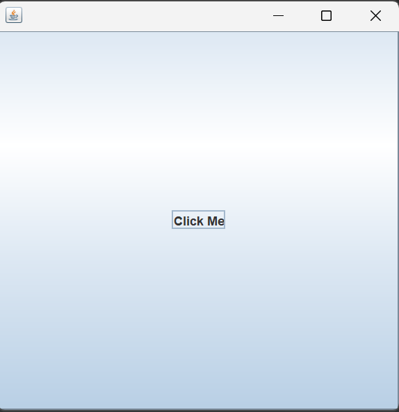
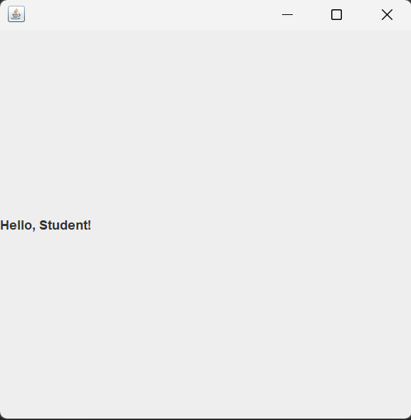

## Part 5: The Layout Problem

## Introduction

If you tried Exercise 6 from Part 4, you already ran into something strange. You added both a `JLabel` and a `JButton` to the same window, but only one of them appeared. The other one seemed to vanish.

This is not a bug. This is not a mistake in your code. This is a layout problem, and it is something every Swing beginner runs into. In this part, you will understand exactly why it happens and what is going on behind the scenes.

> **Before you begin:** Create a new project in your IDE called `JavaSwing_05`. Make sure your package name is `javaswing_05` and your class name is `JavaSwing_05`. This keeps your project aligned with the code in this lesson.

---

## The Problem

Let us write a program that adds both a `JLabel` and a `JButton` to the same frame.

~~~java
package javaswing_05;

import javax.swing.JFrame;
import javax.swing.JLabel;
import javax.swing.JButton;

public class JavaSwing_05 extends JFrame
{
    public JavaSwing_05()
    {
        JLabel label1 = new JLabel("Hello, Student!");
        this.add(label1);

        JButton button1 = new JButton("Click Me");
        this.add(button1);

        this.setSize(400, 400);
        this.setDefaultCloseOperation(JFrame.EXIT_ON_CLOSE);
        this.setVisible(true);
    }

    public static void main(String[] args)
    {
        JavaSwing_05 swing5 = new JavaSwing_05();
    }
}
~~~

You would expect to see both the label and the button inside the window. But when you run this program, only the button appears. The label is nowhere to be seen.

  

---

## Why Does This Happen?

The answer lies in something called the **default layout manager**.

Every `JFrame` comes with a layout manager already set. A layout manager is the object that decides where components go inside the window. You learned about this briefly in Part 2.

The default layout manager for a `JFrame` is called **BorderLayout**. You did not ask for it. You did not set it. It is just there automatically.

BorderLayout divides the window into five regions: North (top), South (bottom), East (right), West (left), and Center (middle). When you call `this.add(component)` without specifying a region, BorderLayout places the component in the **Center** region.

Here is the problem: the Center region can only hold **one component**. When you added the label first, it went into the Center. When you then added the button, it also went into the Center, and it replaced the label. The label is still in memory, but it is hidden behind the button.

This is why only the button is visible. It was added last, so it sits on top of the label in the Center region.

---

## Seeing It Clearly

To prove that BorderLayout is the cause, let us try adding the components in the opposite order. Instead of adding the label first and then the button, we add the button first and then the label.

~~~java
package javaswing_05;

import javax.swing.JFrame;
import javax.swing.JLabel;
import javax.swing.JButton;

public class JavaSwing_05 extends JFrame
{
    public JavaSwing_05()
    {
        JButton button1 = new JButton("Click Me");
        this.add(button1);

        JLabel label1 = new JLabel("Hello, Student!");
        this.add(label1);

        this.setSize(400, 400);
        this.setDefaultCloseOperation(JFrame.EXIT_ON_CLOSE);
        this.setVisible(true);
    }

    public static void main(String[] args)
    {
        JavaSwing_05 swing5 = new JavaSwing_05();
    }
}
~~~

This time, only the label appears and the button is gone. The last component added to the Center wins, and everything added before it gets covered up.

  

---

## What is BorderLayout?

BorderLayout is the default layout manager for every `JFrame`. It divides the window into five regions:

| Region | Position |
|---|---|
| `BorderLayout.NORTH` | Top of the window |
| `BorderLayout.SOUTH` | Bottom of the window |
| `BorderLayout.EAST` | Right side of the window |
| `BorderLayout.WEST` | Left side of the window |
| `BorderLayout.CENTER` | Middle of the window (the default) |

When you call `this.add(component)` with no second argument, the component goes to `CENTER`. Since `CENTER` only holds one component, the last one you add replaces everything before it.

You can actually make BorderLayout work by specifying different regions:

~~~java
this.add(label1, BorderLayout.NORTH);
this.add(button1, BorderLayout.CENTER);
~~~

This would place the label at the top and the button in the middle. But this approach has limits. You only have five regions, and each region holds only one component. For most applications, you need something more flexible.

That is what we will solve in Part 6.

---

## The Real Lesson

The layout problem is not a flaw in Swing. It is actually Swing working exactly as designed. The issue is that the default layout manager is not suited for placing multiple components freely.

The takeaway is simple: if you want to add more than one component to a window and have them all appear on screen, you need to **set a different layout manager**. The default one will not work the way you expect.

In Part 6, you will learn about `FlowLayout`, a layout manager that places components side by side from left to right. It is the simplest layout manager in Swing, and it will solve the problem you encountered in this part.

---

## Key Takeaways

- The default layout manager for a `JFrame` is `BorderLayout`.
- `BorderLayout` divides the window into five regions: North, South, East, West, and Center.
- When you call `this.add(component)` without specifying a region, the component goes to the Center.
- The Center region can only hold one component. If you add multiple components, the last one replaces all the others.
- To display multiple components at the same time, you need to change the layout manager. We will do this in Part 6.

---

## What's Next

In Part 6, you will fix this problem. You will learn about `FlowLayout`, a layout manager that places components next to each other from left to right, like words on a page. With one line of code, your label and button will both appear on screen at the same time.

---

## Practice Exercises

These exercises will help you understand the layout problem and see it for yourself.

**Exercise 1.** Type out the first program from the "The Problem" section by hand. Run it and confirm that only the button appears. Then swap the order so the button is added first and the label is added second. Confirm that now only the label appears.

**Exercise 2.** Try adding three components: a `JLabel`, a `JButton`, and another `JLabel`. Add them in that order. Run the program. Which one appears? Why?

**Exercise 3.** Modify the program to place the label and button in different BorderLayout regions. Use `this.add(label1, BorderLayout.NORTH);` for the label and `this.add(button1, BorderLayout.CENTER);` for the button. You will need to add `import java.awt.BorderLayout;` at the top. Run the program. Do both components appear now?

**Exercise 4.** Building on Exercise 3, try placing components in all five regions. Create five `JButton` components with different labels ("North", "South", "East", "West", "Center") and add each one to its corresponding region. Run the program and observe how BorderLayout arranges them.

**Exercise 5.** In your own words, explain why calling `this.add(label1);` followed by `this.add(button1);` causes the label to disappear. What would you need to do differently to make both visible?

---

*End of Part 5 -- The Layout Problem*

*Next: [Part 6 -- FlowLayout](06-flowlayout.md)*
