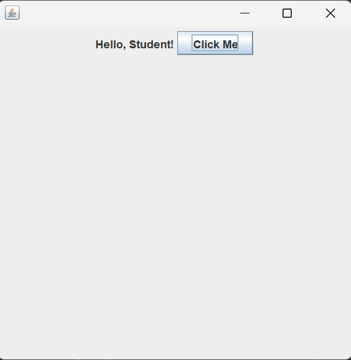
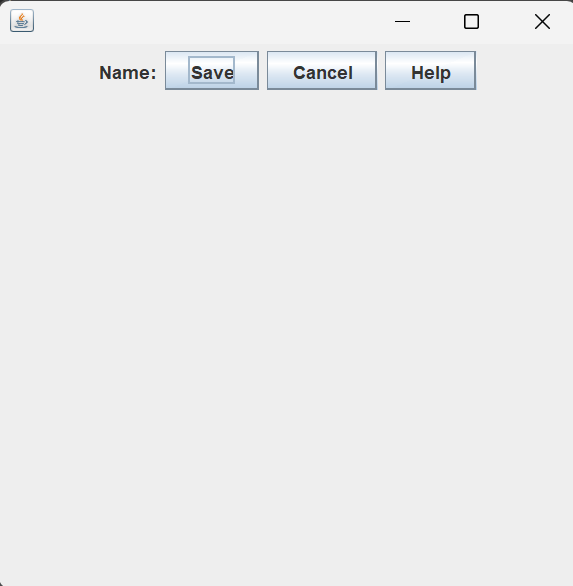
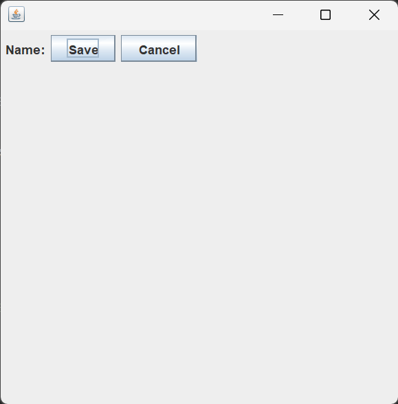

## Part 6: FlowLayout

## Introduction

In Part 5, you discovered the layout problem. When you added a `JLabel` and a `JButton` to the same window, only one of them appeared. The other was hidden behind it because the default `BorderLayout` places everything in the Center region, and the Center can only hold one component.

In this part, you will fix that problem with one line of code. You will learn about `FlowLayout`, a layout manager that places components next to each other from left to right, like words on a page. Once you set it, all your components will appear on screen at the same time.

> **Before you begin:** Create a new project in your IDE called `JavaSwing_06`. Make sure your package name is `javaswing_06` and your class name is `JavaSwing_06`. This keeps your project aligned with the code in this lesson.

---

## What is FlowLayout?

`FlowLayout` is a layout manager that arranges components in a row from left to right. When there is no more space in the current row, it wraps to the next line, just like text in a paragraph.

It is the simplest layout manager in Swing. There are no regions to think about, no positions to specify. You add components and they line up one after another in the order you added them.

`FlowLayout` lives in the `java.awt` package, not in `javax.swing`. This is because layout managers are part of Java's older AWT (Abstract Window Toolkit) library, which Swing is built on top of. You will need to import it separately.

---

## Fixing the Layout Problem

Let us take the exact same program from Part 5 that had the problem and fix it by adding one line of code.

~~~java
package javaswing_06;

import javax.swing.JFrame;
import javax.swing.JLabel;
import javax.swing.JButton;
import java.awt.FlowLayout;

public class JavaSwing_06 extends JFrame
{
    public JavaSwing_06()
    {
        this.setLayout(new FlowLayout());

        JLabel label1 = new JLabel("Hello, Student!");
        this.add(label1);

        JButton button1 = new JButton("Click Me");
        this.add(button1);

        this.setSize(400, 400);
        this.setDefaultCloseOperation(JFrame.EXIT_ON_CLOSE);
        this.setVisible(true);
    }

    public static void main(String[] args)
    {
        JavaSwing_06 swing6 = new JavaSwing_06();
    }
}
~~~

When you run this program, both the label and the button appear inside the window. The label is on the left and the button is right next to it. The layout problem is solved.

  

---

## Understanding the New Code

Only two things are new in this program compared to Part 5.

### The Import

~~~java
import java.awt.FlowLayout;
~~~

Notice this import comes from `java.awt`, not `javax.swing`. This is the only import in this series so far that does not come from the Swing package. Layout managers are part of AWT, the older graphics toolkit that Swing builds on.

### Setting the Layout

~~~java
this.setLayout(new FlowLayout());
~~~

This is the line that fixes everything. It tells the frame to stop using the default `BorderLayout` and start using `FlowLayout` instead. After this line, every component you add with `this.add()` will be placed in a row from left to right.

We place this line at the very top of the constructor, before creating any components. This way the layout manager is ready before we start adding things to the frame.

> **Note:** `this.setLayout(new FlowLayout())` replaces the default `BorderLayout`. Once you set a layout manager, it controls how all components are arranged inside the frame.

---

## Adding More Components

With `FlowLayout`, you can add as many components as you want and they will all appear on screen. Let us add several components to see how FlowLayout arranges them.

~~~java
package javaswing_06;

import javax.swing.JFrame;
import javax.swing.JLabel;
import javax.swing.JButton;
import java.awt.FlowLayout;

public class JavaSwing_06 extends JFrame
{
    public JavaSwing_06()
    {
        this.setLayout(new FlowLayout());

        JLabel label1 = new JLabel("Name:");
        this.add(label1);

        JButton button1 = new JButton("Save");
        this.add(button1);

        JButton button2 = new JButton("Cancel");
        this.add(button2);

        JButton button3 = new JButton("Help");
        this.add(button3);

        this.setSize(400, 400);
        this.setDefaultCloseOperation(JFrame.EXIT_ON_CLOSE);
        this.setVisible(true);
    }

    public static void main(String[] args)
    {
        JavaSwing_06 swing6 = new JavaSwing_06();
    }
}
~~~

When you run this program, all four components appear in a row: the label followed by the three buttons, one after another from left to right.

  

---

## How FlowLayout Arranges Components

FlowLayout follows three simple rules:

**Rule 1: Left to right.** Components are placed in a horizontal row starting from the left. Each new component goes to the right of the previous one.

**Rule 2: Wrapping.** When there is no more horizontal space in the current row, the next component wraps to a new row below. Try resizing the window to make it narrower and you will see the components rearrange themselves.

**Rule 3: Centered by default.** Each row of components is centered horizontally in the window. If you have a wide window and only a few small components, they will sit in the middle rather than sticking to the left.

> **Note:** Try resizing the window while the program is running. Make it very narrow and watch the components wrap to new rows. Make it very wide and watch them spread out in a single row. This is FlowLayout responding to the available space.

---

## FlowLayout Alignment Options

By default, FlowLayout centers each row of components. You can change this by passing an alignment option when you create the layout.

~~~java
// Center alignment (the default)
this.setLayout(new FlowLayout(FlowLayout.CENTER));

// Left alignment
this.setLayout(new FlowLayout(FlowLayout.LEFT));

// Right alignment
this.setLayout(new FlowLayout(FlowLayout.RIGHT));
~~~

Let us see left alignment in action:

~~~java
package javaswing_06;

import javax.swing.JFrame;
import javax.swing.JLabel;
import javax.swing.JButton;
import java.awt.FlowLayout;

public class JavaSwing_06 extends JFrame
{
    public JavaSwing_06()
    {
        this.setLayout(new FlowLayout(FlowLayout.LEFT));

        JLabel label1 = new JLabel("Name:");
        this.add(label1);

        JButton button1 = new JButton("Save");
        this.add(button1);

        JButton button2 = new JButton("Cancel");
        this.add(button2);

        this.setSize(400, 400);
        this.setDefaultCloseOperation(JFrame.EXIT_ON_CLOSE);
        this.setVisible(true);
    }

    public static void main(String[] args)
    {
        JavaSwing_06 swing6 = new JavaSwing_06();
    }
}
~~~

With `FlowLayout.LEFT`, the components start from the left edge of the window instead of being centered.

  

---

## Comparing the Layout Managers

You now know two layout managers. Here is how they compare:

| Feature | BorderLayout (default) | FlowLayout |
|---|---|---|
| How it arranges components | Divides the window into 5 regions (North, South, East, West, Center) | Places components left to right in a row |
| What happens with multiple components | Only one component per region. Components in the same region replace each other. | All components appear. They wrap to the next row when space runs out. |
| Alignment | Components fill their entire region | Components keep their natural size and are centered by default |
| When to use it | When you want components in specific positions (top, bottom, sides, center) | When you want components to flow naturally in a row |
| Set with | Default. No code needed. | `this.setLayout(new FlowLayout())` |

---

## The Updated Constructor Pattern

Your constructor now has four parts:

~~~java
public JavaSwing_06()
{
    // 1. Set the layout manager
    this.setLayout(new FlowLayout());

    // 2. Create and add components
    JLabel label1 = new JLabel("Hello, Student!");
    this.add(label1);

    JButton button1 = new JButton("Click Me");
    this.add(button1);

    // 3. Configure the window
    this.setSize(400, 400);
    this.setDefaultCloseOperation(JFrame.EXIT_ON_CLOSE);

    // 4. Make the window visible (always last)
    this.setVisible(true);
}
~~~

**First**, set the layout manager. This ensures the layout is ready before you add any components.

**Second**, create and add your components. They will be arranged according to the layout you set.

**Third**, configure window properties like size and close behavior.

**Fourth**, call `this.setVisible(true)` to display everything at once.

This pattern will stay consistent for the rest of the series.

---

## Key Takeaways

- `FlowLayout` arranges components left to right in a row. When space runs out, components wrap to the next row.
- To use `FlowLayout`, import it with `import java.awt.FlowLayout;` and set it with `this.setLayout(new FlowLayout());`.
- `FlowLayout` centers components by default. You can change this to left or right alignment by passing `FlowLayout.LEFT` or `FlowLayout.RIGHT`.
- Set the layout manager at the top of the constructor, before creating and adding any components.
- With `FlowLayout`, every component you add will appear on screen. No more components hiding behind each other.

---

## What's Next

You now have a label and a button on screen at the same time, and you know how to arrange them with `FlowLayout`. But the button still does nothing when you click it. In Part 7, you will learn about event handling and make your button respond to clicks for the first time.

---

## Practice Exercises

These exercises will help you get comfortable with `FlowLayout`.

**Exercise 1.** Type out the first complete program from the "Fixing the Layout Problem" section by hand. Run it and confirm that both the label and the button appear on screen.

**Exercise 2.** Add five buttons to the frame with labels "One", "Two", "Three", "Four", and "Five". Use `FlowLayout`. Run the program and see how they are arranged. Then resize the window to make it narrower and watch the buttons wrap to the next row.

**Exercise 3.** Change the layout from `new FlowLayout()` to `new FlowLayout(FlowLayout.LEFT)`. Run the program. How does the position of the components change? Then try `FlowLayout.RIGHT` and observe the difference.

**Exercise 4.** Remove the `this.setLayout(new FlowLayout());` line from the program that has both a `JLabel` and a `JButton`. Run it. Confirm that the layout problem from Part 5 comes back. Then add the line back and confirm it is fixed.

**Exercise 5.** Create a program with three `JLabel` components and two `JButton` components. Arrange them so they appear in this order: label, button, label, button, label. Use `FlowLayout`. Run the program and observe that the order you add them is the order they appear.

**Exercise 6.** Try creating a `FlowLayout` with gaps: `new FlowLayout(FlowLayout.CENTER, 20, 20)`. The second number is the horizontal gap between components and the third is the vertical gap. Run the program and compare the spacing to the default `FlowLayout()`. Try different values and observe the changes.

---

*End of Part 6 -- FlowLayout*

*Next: [Part 7 -- Event Handling: Button Clicks](07-event-handling-button-clicks.md)*
