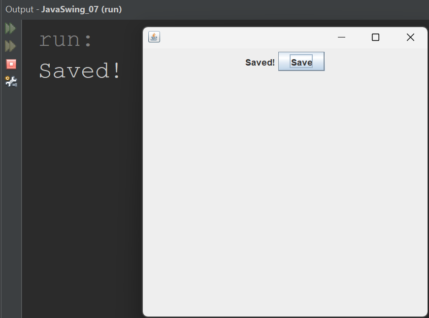
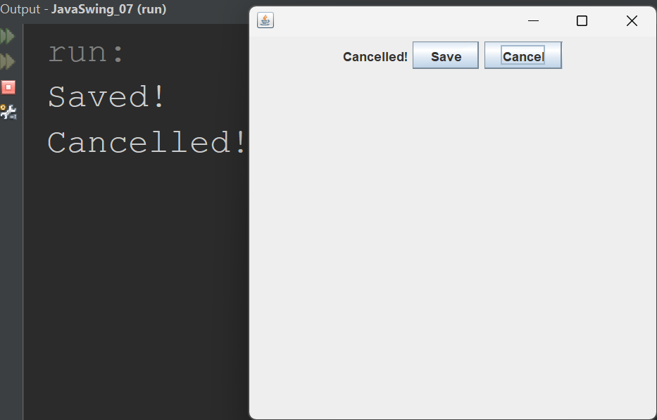

## Part 7: Event Handling -- Button Clicks

## Introduction

In Part 4, you added a `JButton` to your window. You could see it, you could click it, but nothing happened. In Part 6, you learned how to display multiple components using `FlowLayout`. Now it is time to bring your buttons to life.

In this part, you will learn how to make a button respond when the user clicks it. This is called **event handling**. When the user clicks a button, that click is an "event", and you write code that tells Java what to do when that event occurs.

By the end of this lesson, your buttons will change text on screen and print messages to the console when clicked.

> **Before you begin:** Create a new project in your IDE called `JavaSwing_07`. Make sure your package name is `javaswing_07` and your class name is `JavaSwing_07`. This keeps your project aligned with the code in this lesson.

---

## What is Event Handling?

Every time a user interacts with a GUI, something happens behind the scenes. Clicking a button, typing into a text field, moving the mouse: these are all **events**. Event handling is the process of writing code that responds to these events.

In Swing, the process works like this:

1. The user does something (for example, clicks a button).
2. Java creates an **event object** that describes what happened.
3. Java sends that event to a **listener**, a piece of code you wrote that knows what to do with it.

For button clicks, the listener is called an `ActionListener`. Your job is to tell Java that your class is an `ActionListener` and then write the code that runs when a button is clicked.

---

## The ActionListener Interface

An `ActionListener` is an interface in the `java.awt.event` package. An interface is like a contract. When your class says it implements `ActionListener`, it is promising to provide a method called `actionPerformed`. This method is what Java calls every time a button is clicked.

Here is what changes in the class declaration:

~~~java
// Before: our class is just a window
public class JavaSwing_07 extends JFrame

// After: our class is a window AND a listener
public class JavaSwing_07 extends JFrame implements ActionListener
~~~

By adding `implements ActionListener`, we are telling Java two things: this class IS a window (because of `extends JFrame`) and this class LISTENS for actions (because of `implements ActionListener`).

---

## One Button, One Action

Let us start simple. One button, one label. When the user clicks the button, the label text changes and a message prints to the console.

~~~java
package javaswing_07;

import javax.swing.JFrame;
import javax.swing.JLabel;
import javax.swing.JButton;
import java.awt.FlowLayout;
import java.awt.event.ActionEvent;
import java.awt.event.ActionListener;

public class JavaSwing_07 extends JFrame implements ActionListener
{
    JLabel messageLabel;
    JButton saveButton;

    public JavaSwing_07()
    {
        this.setLayout(new FlowLayout());

        messageLabel = new JLabel("Welcome!");
        this.add(messageLabel);

        saveButton = new JButton("Save");
        saveButton.addActionListener(this);
        this.add(saveButton);

        this.setSize(400, 400);
        this.setDefaultCloseOperation(JFrame.EXIT_ON_CLOSE);
        this.setVisible(true);
    }

    @Override
    public void actionPerformed(ActionEvent event)
    {
        messageLabel.setText("Saved!");
        System.out.println("Saved!");
    }

    public static void main(String[] args)
    {
        JavaSwing_07 swing7 = new JavaSwing_07();
    }
}
~~~

When you run this program, you see a label that says "Welcome!" and a button that says "Save". Click the button and two things happen at the same time: the label changes to "Saved!" on the window, and the message "Saved!" is printed to the console in your IDE.

  

---

## Understanding the New Code

There is a lot of new code here compared to previous parts. Let us go through each new piece carefully.

### The New Imports

~~~java
import java.awt.event.ActionEvent;
import java.awt.event.ActionListener;
~~~

These two imports come from the `java.awt.event` package. `ActionListener` is the interface we implement. `ActionEvent` is the event object that Java creates when a button is clicked and passes to our `actionPerformed` method.

### The Class Declaration

~~~java
public class JavaSwing_07 extends JFrame implements ActionListener
~~~

Our class now does two things. It extends `JFrame`, which means it is a window. It implements `ActionListener`, which means it can respond to button clicks. The `implements` keyword is how you tell Java that your class fulfills the contract of an interface.

### Instance Variables

~~~java
JLabel messageLabel;
JButton saveButton;
~~~

In previous parts, we created our components inside the constructor as local variables. Now we declare them at the **class level**, outside the constructor. These are called **instance variables**.

We need to do this because the `actionPerformed` method needs to access these components. If they were local variables inside the constructor, the `actionPerformed` method would not be able to see them. By declaring them at the class level, every method in the class can use them.

~~~java
public class JavaSwing_07 extends JFrame implements ActionListener
{
    // Instance variables - accessible by ALL methods in the class
    JLabel messageLabel;
    JButton saveButton;

    public JavaSwing_07()
    {
        // Constructor can access messageLabel and saveButton
    }

    public void actionPerformed(ActionEvent event)
    {
        // This method can ALSO access messageLabel and saveButton
    }
}
~~~

### Registering the Listener

~~~java
saveButton.addActionListener(this);
~~~

This line connects the button to the listener. It says: "when this button is clicked, send the event to `this` object." Since our class implements `ActionListener`, `this` is a valid listener.

Without this line, clicking the button would do nothing. The button would not know who to notify when it gets clicked.

### The actionPerformed Method

~~~java
@Override
public void actionPerformed(ActionEvent event)
{
    messageLabel.setText("Saved!");
    System.out.println("Saved!");
}
~~~

This is the method that Java calls when the button is clicked. It receives an `ActionEvent` object called `event` that contains information about what happened.

Inside this method, we do two things. First, we change the label text to "Saved!" using `messageLabel.setText()`. Second, we print "Saved!" to the console using `System.out.println()`. The label change is visible on the window. The console message is visible in your IDE output panel. Both confirm that the button click triggered your code.

The `@Override` annotation tells Java that this method is fulfilling the contract of the `ActionListener` interface. It is not strictly required, but it is good practice because Java will give you a warning if you accidentally misspell the method name.

---

## Meaningful Variable Names

Notice that we named our variables `saveButton` and `messageLabel` instead of `button1` and `label1`. This is intentional and important.

As your programs grow, you will have many buttons and labels. If they are all called `button1`, `button2`, `button3`, you will constantly have to scroll back up to remember which is which. With meaningful names, the code reads clearly:

~~~java
// Confusing: which button is which?
if (event.getSource() == button1)
if (event.getSource() == button2)

// Clear: the name tells you exactly what it does
if (event.getSource() == saveButton)
if (event.getSource() == cancelButton)
~~~

From this point forward, always name your components after what they do, not with numbers.

---

## Two Buttons, Two Actions

Now let us add a second button. When you have multiple buttons, you need a way to tell them apart inside `actionPerformed`. We use `event.getSource()` to check which button was clicked.

~~~java
package javaswing_07;

import javax.swing.JFrame;
import javax.swing.JLabel;
import javax.swing.JButton;
import java.awt.FlowLayout;
import java.awt.event.ActionEvent;
import java.awt.event.ActionListener;

public class JavaSwing_07 extends JFrame implements ActionListener
{
    JLabel messageLabel;
    JButton saveButton;
    JButton cancelButton;

    public JavaSwing_07()
    {
        this.setLayout(new FlowLayout());

        messageLabel = new JLabel("Welcome!");
        this.add(messageLabel);

        saveButton = new JButton("Save");
        saveButton.addActionListener(this);
        this.add(saveButton);

        cancelButton = new JButton("Cancel");
        cancelButton.addActionListener(this);
        this.add(cancelButton);

        this.setSize(400, 400);
        this.setDefaultCloseOperation(JFrame.EXIT_ON_CLOSE);
        this.setVisible(true);
    }

    @Override
    public void actionPerformed(ActionEvent event)
    {
        if (event.getSource() == saveButton)
        {
            messageLabel.setText("Saved!");
            System.out.println("Saved!");
        }

        if (event.getSource() == cancelButton)
        {
            messageLabel.setText("Cancelled!");
            System.out.println("Cancelled!");
        }
    }

    public static void main(String[] args)
    {
        JavaSwing_07 swing7 = new JavaSwing_07();
    }
}
~~~

When you run this program, you see a label and two buttons. Click "Save" and the label changes to "Saved!" while "Saved!" prints to the console. Click "Cancel" and the label changes to "Cancelled!" while "Cancelled!" prints to the console. Each button triggers its own action.

  

---

## Understanding event.getSource()

When any button is clicked, Java calls the `actionPerformed` method. But with multiple buttons, you need to know **which** button was clicked. That is what `event.getSource()` gives you. It returns the object that triggered the event.

~~~java
if (event.getSource() == saveButton)
~~~

This line asks: "is the object that triggered this event the same object as `saveButton`?" If yes, the code inside the `if` block runs. If no, Java moves on to the next `if` statement.

Each button needs its own `addActionListener(this)` call. If you forget to add the listener to a button, that button will not trigger `actionPerformed` when clicked.

~~~java
saveButton.addActionListener(this);    // Save button will trigger actionPerformed
cancelButton.addActionListener(this);  // Cancel button will trigger actionPerformed
~~~

> **Note:** Both the label text change and the console print happen at the same time when you click a button. The label confirms the action visually in the window. The console confirms it in your IDE output. Watching both helps you understand exactly when your code runs.

---

## The Complete Picture

Here is how all the pieces of event handling connect:

**Step 1:** The class implements `ActionListener`, promising to provide an `actionPerformed` method.

**Step 2:** Components are declared as instance variables so that all methods in the class can access them.

**Step 3:** Each button calls `addActionListener(this)` to register the class as its listener.

**Step 4:** When a button is clicked, Java calls `actionPerformed` and passes an `ActionEvent` object.

**Step 5:** Inside `actionPerformed`, you use `event.getSource()` to check which button was clicked and respond accordingly.

---

## Key Takeaways

- Event handling is how you make your GUI respond to user actions like button clicks.
- `ActionListener` is an interface that requires you to write an `actionPerformed` method.
- Adding `implements ActionListener` to your class declaration makes your class a listener.
- Components must be declared as instance variables (at the class level) so that `actionPerformed` can access them.
- Each button must call `addActionListener(this)` to connect it to the listener.
- Use `event.getSource()` to determine which button was clicked when you have multiple buttons.
- Updating the label and printing to the console at the same time lets you confirm your code is working in two places.

---

## What's Next

Your buttons are now alive. In Part 8, you will learn about `JTextField`, a component that lets the user type text into the window. Combined with buttons and event handling, you will be able to read what the user types and respond to it.

---

## Practice Exercises

These exercises will help you get comfortable with event handling.

**Exercise 1.** Type out the first program (one button) from the "One Button, One Action" section by hand. Run it. Click the Save button and confirm that the label changes to "Saved!" and the message "Saved!" appears in the console.

**Exercise 2.** Type out the second program (two buttons) from the "Two Buttons, Two Actions" section by hand. Run it. Click each button and confirm that the correct message appears both on the label and in the console.

**Exercise 3.** Add a third button called `resetButton` with the text "Reset". When clicked, it should change the label back to "Welcome!" and print "Reset!" to the console. Remember to declare it as an instance variable, add the listener, and add an `if` check in `actionPerformed`.

**Exercise 4.** Remove the `saveButton.addActionListener(this);` line from the two-button program. Run it and click the Save button. What happens? Does `actionPerformed` get called? Add the line back when you are done.

**Exercise 5.** Create a program with a label and four buttons: "Happy", "Sad", "Excited", and "Calm". When each button is clicked, the label should display a message matching the mood (for example "I am happy!") and print the same message to the console.

**Exercise 6.** In the two-button program, try declaring `messageLabel` as a local variable inside the constructor instead of as an instance variable. What error do you get? Why? Move it back to the class level when you are done.

---

*End of Part 7 -- Event Handling: Button Clicks*

*Next: [Part 8 -- JTextField](08-jtextfield.md)*
