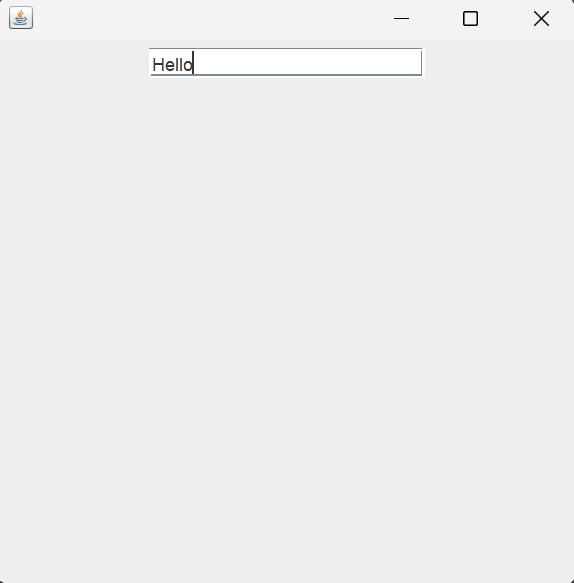
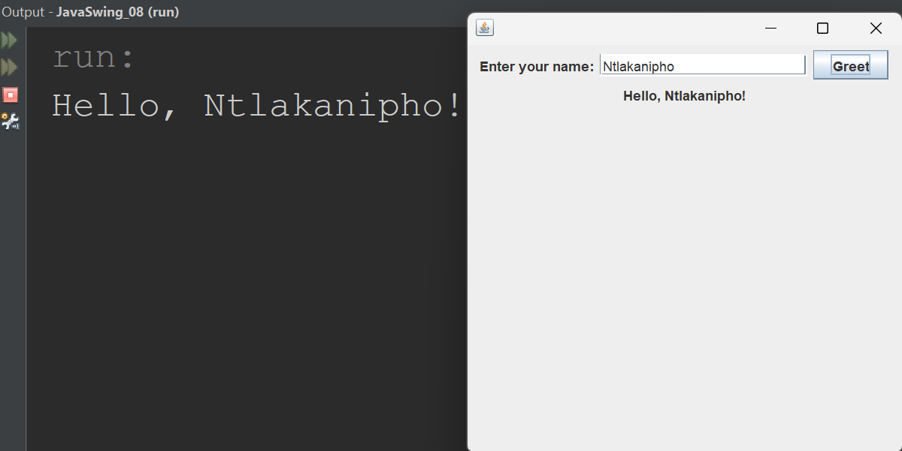

## Part 8: JTextField

## Introduction

So far, your applications have been one-directional. You display text with `JLabel`, and you respond to clicks with `JButton`. But the user has no way to give you information. They cannot type anything into the window.

In this part, you will learn about `JTextField`, a component that lets the user type text into your application. Combined with buttons and event handling from Part 7, you will be able to read what the user types and respond to it. This is where your applications start becoming truly interactive.

> **Before you begin:** Create a new project in your IDE called `JavaSwing_08`. Make sure your package name is `javaswing_08` and your class name is `JavaSwing_08`. This keeps your project aligned with the code in this lesson.

---

## What is a JTextField?

A `JTextField` is a Swing component that displays a single-line text input area. The user can click on it, type text into it, and your program can read what they typed.

You see text fields everywhere in applications: login forms, search bars, registration pages, and settings screens. Anywhere an application asks you to type something, there is a text field.

Like `JLabel` and `JButton`, the `JTextField` class lives in the `javax.swing` package and needs to be imported before you can use it.

---

## Adding a JTextField to the Frame

Let us start by simply placing a text field in the window. No buttons, no event handling yet. Just seeing the text field on screen.

~~~java
package javaswing_08;

import javax.swing.JFrame;
import javax.swing.JTextField;
import java.awt.FlowLayout;

public class JavaSwing_08 extends JFrame
{
    JTextField nameField;

    public JavaSwing_08()
    {
        this.setLayout(new FlowLayout());

        nameField = new JTextField(20);
        this.add(nameField);

        this.setSize(400, 400);
        this.setDefaultCloseOperation(JFrame.EXIT_ON_CLOSE);
        this.setVisible(true);
    }

    public static void main(String[] args)
    {
        JavaSwing_08 swing8 = new JavaSwing_08();
    }
}
~~~

When you run this program, a window appears with a text input area. You can click on it and type. The text field is empty by default and ready for user input.

  

---

## Understanding the New Code

### The Import

~~~java
import javax.swing.JTextField;
~~~

Same pattern as before. Every new Swing component needs its own import from `javax.swing`.

### Creating the JTextField

~~~java
nameField = new JTextField(20);
~~~

This creates a new text field and stores it in an instance variable called `nameField`. The number `20` inside the parentheses is the **column width**. It tells Swing roughly how wide the text field should be. It does not limit how many characters the user can type. It only affects the visual size of the field on screen.

Here is how different column widths compare:

~~~java
new JTextField(10);   // Narrow text field
new JTextField(20);   // Medium text field
new JTextField(40);   // Wide text field
~~~

> **Note:** The column width is an approximation, not an exact pixel measurement. Swing uses the average character width of the current font to calculate the size. The user can still type more characters than the column width. The text will simply scroll horizontally inside the field.

---

## JTextField with Default Text

You can also create a text field with text already inside it. This is useful for showing placeholder text or default values.

~~~java
// Empty text field with column width of 20
nameField = new JTextField(20);

// Text field with default text and column width of 20
nameField = new JTextField("Type your name here", 20);
~~~

The first argument is the default text that appears inside the field. The second argument is the column width. The user can delete the default text and type their own.

---

## Reading Text from a JTextField

Displaying a text field is only half the story. The real power comes from reading what the user typed. You do this with the `getText()` method.

Let us build a complete example. The user types their name into the text field, clicks a button, and the program reads the name and displays a greeting.

~~~java
package javaswing_08;

import javax.swing.JFrame;
import javax.swing.JLabel;
import javax.swing.JTextField;
import javax.swing.JButton;
import java.awt.FlowLayout;
import java.awt.event.ActionEvent;
import java.awt.event.ActionListener;

public class JavaSwing_08 extends JFrame implements ActionListener
{
    JLabel promptLabel;
    JTextField nameField;
    JButton greetButton;
    JLabel messageLabel;

    public JavaSwing_08()
    {
        this.setLayout(new FlowLayout());

        promptLabel = new JLabel("Enter your name:");
        this.add(promptLabel);

        nameField = new JTextField(20);
        this.add(nameField);

        greetButton = new JButton("Greet");
        greetButton.addActionListener(this);
        this.add(greetButton);

        messageLabel = new JLabel("...");
        this.add(messageLabel);

        this.setSize(400, 400);
        this.setDefaultCloseOperation(JFrame.EXIT_ON_CLOSE);
        this.setVisible(true);
    }

    @Override
    public void actionPerformed(ActionEvent event)
    {
        if (event.getSource() == greetButton)
        {
            String name = nameField.getText();
            messageLabel.setText("Hello, " + name + "!");
            System.out.println("Hello, " + name + "!");
        }
    }

    public static void main(String[] args)
    {
        JavaSwing_08 swing8 = new JavaSwing_08();
    }
}
~~~

When you run this program, you see a label that says "Enter your name:", a text field, a "Greet" button, and a label that says "...". Type your name into the text field and click the button. The bottom label changes to "Hello, [your name]!" and the same message prints to the console.

  

---

## Understanding the Greeting Program

Let us focus on the parts that are new.

### Four Components Working Together

This program uses four components, each with a clear purpose:

| Component | Variable Name | Purpose |
|---|---|---|
| `JLabel` | `promptLabel` | Tells the user what to type |
| `JTextField` | `nameField` | Lets the user type their name |
| `JButton` | `greetButton` | Triggers the greeting action |
| `JLabel` | `messageLabel` | Displays the greeting result |

Notice how each variable name describes exactly what the component does. `promptLabel` is the prompt. `nameField` is where the name goes. `greetButton` is the button that triggers the greeting. `messageLabel` is where the message appears.

### Reading the Text

~~~java
String name = nameField.getText();
~~~

This is the key line. `nameField.getText()` returns whatever the user has typed into the text field as a `String`. We store it in a variable called `name` and use it to build the greeting message.

### Displaying the Result

~~~java
messageLabel.setText("Hello, " + name + "!");
System.out.println("Hello, " + name + "!");
~~~

We use string concatenation to combine "Hello, " with the user's name and "!" to create the full greeting. This greeting is displayed in two places: the label on the window and the console in your IDE. Both confirm that the program successfully read the user's input.

---

## Setting Text in a JTextField

Just as you can read text from a text field with `getText()`, you can also set text programmatically with `setText()`. This is useful for clearing the field after the user submits their input.

~~~java
// Read the text
String name = nameField.getText();

// Clear the field after reading
nameField.setText("");
~~~

Let us update the `actionPerformed` method to clear the text field after the greeting is displayed:

~~~java
@Override
public void actionPerformed(ActionEvent event)
{
    if (event.getSource() == greetButton)
    {
        String name = nameField.getText();
        messageLabel.setText("Hello, " + name + "!");
        System.out.println("Hello, " + name + "!");
        nameField.setText("");
    }
}
~~~

Now when the user clicks "Greet", the greeting appears, the message prints to the console, and the text field is cleared, ready for the next input.

---

## getText() and setText() Summary

These two methods are how you interact with a `JTextField` in code:

| Method | What It Does | Example |
|---|---|---|
| `getText()` | Returns the text the user typed as a `String` | `String name = nameField.getText();` |
| `setText("text")` | Sets the text inside the field to the specified value | `nameField.setText("");` |
| `setText("")` | Clears the text field | `nameField.setText("");` |

These same methods also work on `JLabel`. You have already been using `setText()` on labels since Part 7 to change the displayed text. The `getText()` method works on labels too, though you will rarely need to read text from a label since you are the one who set it.

---

## How Everything Connects

Take a step back and look at what you can do now. Across Parts 1 through 8, you have built up a complete set of skills:

| Part | What You Learned | Component |
|---|---|---|
| Part 1 | Creating a window | `JFrame` |
| Part 3 | Displaying text | `JLabel` |
| Part 4 | Adding buttons | `JButton` |
| Part 6 | Arranging components | `FlowLayout` |
| Part 7 | Responding to clicks | `ActionListener` |
| Part 8 | Reading user input | `JTextField` |

With these six pieces, you can build an application that displays information, accepts input, and responds to user actions. That is the foundation of every GUI application.

---

## Key Takeaways

- A `JTextField` is a Swing component that lets the user type text into the window.
- To use `JTextField`, import it with `import javax.swing.JTextField;`.
- The number you pass when creating a text field (`new JTextField(20)`) sets the visual width, not a character limit.
- Use `getText()` to read what the user typed and `setText()` to change or clear the text field.
- Combining `JLabel`, `JTextField`, `JButton`, and `ActionListener` allows you to build interactive applications that accept input and display results.
- Always display results in two places (label and console) to confirm your code is working.

---

## What's Next

You now have all the building blocks to create a real application. In Part 9, you will combine everything you have learned into a single program with multiple labels, text fields, and buttons working together. This will prepare you for Part 10, where you will build a complete login form.

---

## Practice Exercises

These exercises will help you get comfortable with `JTextField`.

**Exercise 1.** Type out the greeting program from the "Reading Text from a JTextField" section by hand. Run it. Type your name and click the button. Confirm that the greeting appears on the label and in the console.

**Exercise 2.** Modify the greeting program so that the text field is cleared after the button is clicked. Use `nameField.setText("");` inside `actionPerformed`. Run it and confirm the field empties after each greeting.

**Exercise 3.** Create a text field with default text: `new JTextField("Type here", 20)`. Run the program. What appears inside the text field? Delete the default text, type something new, and click the button to confirm `getText()` reads your new text.

**Exercise 4.** Change the column width from 20 to 5. Run the program. How does the text field look? Can you still type a long name? Now try 40 and observe the difference. Remember, the column width only affects the visual size, not the character limit.

**Exercise 5.** Create a program with two text fields: one for a first name and one for a last name. Add a label before each text field ("First name:" and "Last name:"). Add a single "Greet" button. When clicked, the message label should display "Hello, [first] [last]!" and print the same to the console. You will need to call `getText()` on both text fields.

**Exercise 6.** Create a simple addition calculator. Add two text fields (for two numbers), a button that says "Add", and a message label. When the button is clicked, read both text fields, convert them to integers using `Integer.parseInt()`, add them together, and display the result on the label and in the console. For example, if the user types "5" and "3", the label should show "Result: 8".

---

*End of Part 8 -- JTextField*

*Next: [Part 9 -- Combining Components](09-combining-components.md)*
