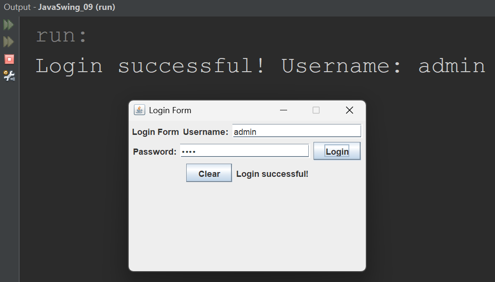

## Part 9: Building a Login Form

## Introduction

This is the final part of the series. Over the past eight lessons, you learned how to create a window, display text, add buttons, arrange components with a layout manager, handle button clicks, and read user input. Now you will put all of those skills together to build something real: a login form.

Login forms are one of the most common screens in software. Every application that has user accounts starts with one. By the end of this lesson, you will have a working login form with a username field, a password field, a login button, a clear button, and feedback messages that tell the user whether their login was successful.

> **Before you begin:** Create a new project in your IDE called `JavaSwing_09`. Make sure your package name is `javaswing_09` and your class name is `JavaSwing_09`. This keeps your project aligned with the code in this lesson.

---

## Planning the Form

Before writing any code, let us plan what the form needs. Good programmers think about what they are building before they start typing.

Our login form needs the following components:

| Component | Variable Name | Purpose |
|---|---|---|
| `JLabel` | `titleLabel` | Displays the title "Login Form" at the top |
| `JLabel` | `usernameLabel` | Tells the user to enter their username |
| `JTextField` | `usernameField` | Lets the user type their username |
| `JLabel` | `passwordLabel` | Tells the user to enter their password |
| `JPasswordField` | `passwordField` | Lets the user type their password (hidden) |
| `JButton` | `loginButton` | Submits the login attempt |
| `JButton` | `clearButton` | Clears all fields and resets the form |
| `JLabel` | `messageLabel` | Displays feedback ("Login successful!" or "Invalid username or password.") |

That is three labels, one text field, one password field, two buttons, and one message label. Eight components total.

---

## What is a JPasswordField?

Before we write the full program, there is one new component to learn: `JPasswordField`.

A `JPasswordField` works exactly like a `JTextField`, but it hides the characters the user types. Instead of showing the actual letters, it displays dots or asterisks. This prevents someone looking over the user's shoulder from reading the password.

~~~java
// A regular text field - text is visible
JTextField usernameField = new JTextField(20);

// A password field - text is hidden
JPasswordField passwordField = new JPasswordField(20);
~~~

The `JPasswordField` class lives in the `javax.swing` package, just like the other components. You create it the same way as a `JTextField`, with a column width that controls the visual size.

The one difference is how you read the text. Instead of `getText()`, you use `getPassword()`. This method returns a character array, so we wrap it with `new String()` to convert it to a regular `String`:

~~~java
// Reading from a JTextField
String username = usernameField.getText();

// Reading from a JPasswordField
String password = new String(passwordField.getPassword());
~~~

> **Note:** `getPassword()` returns a `char[]` instead of a `String` for security reasons. In professional applications, character arrays can be cleared from memory after use, while strings cannot. For our learning purposes, converting it to a `String` with `new String()` works perfectly fine.

---

## The Complete Login Form

Here is the full program. Read through it first, then we will break down the important parts.

~~~java
package javaswing_09;

import javax.swing.JFrame;
import javax.swing.JLabel;
import javax.swing.JTextField;
import javax.swing.JPasswordField;
import javax.swing.JButton;
import java.awt.FlowLayout;
import java.awt.event.ActionEvent;
import java.awt.event.ActionListener;

public class JavaSwing_09 extends JFrame implements ActionListener
{
    JLabel titleLabel;
    JLabel usernameLabel;
    JTextField usernameField;
    JLabel passwordLabel;
    JPasswordField passwordField;
    JButton loginButton;
    JButton clearButton;
    JLabel messageLabel;

    public JavaSwing_09()
    {
        this.setLayout(new FlowLayout());

        titleLabel = new JLabel("Login Form");
        this.add(titleLabel);

        usernameLabel = new JLabel("Username:");
        this.add(usernameLabel);

        usernameField = new JTextField(20);
        this.add(usernameField);

        passwordLabel = new JLabel("Password:");
        this.add(passwordLabel);

        passwordField = new JPasswordField(20);
        this.add(passwordField);

        loginButton = new JButton("Login");
        loginButton.addActionListener(this);
        this.add(loginButton);

        clearButton = new JButton("Clear");
        clearButton.addActionListener(this);
        this.add(clearButton);

        messageLabel = new JLabel("Enter your credentials.");
        this.add(messageLabel);

        this.setTitle("Login Form");
        this.setSize(350, 250);
        this.setDefaultCloseOperation(JFrame.EXIT_ON_CLOSE);
        this.setLocationRelativeTo(null);
        this.setResizable(false);
        this.setVisible(true);
    }

    @Override
    public void actionPerformed(ActionEvent event)
    {
        if (event.getSource() == loginButton)
        {
            String username = usernameField.getText();
            String password = new String(passwordField.getPassword());

            if (username.equals("admin") && password.equals("1234"))
            {
                messageLabel.setText("Login successful!");
                System.out.println("Login successful! Username: " + username);
            }
            else
            {
                messageLabel.setText("Invalid username or password.");
                System.out.println("Login failed. Username: " + username);
            }
        }

        if (event.getSource() == clearButton)
        {
            usernameField.setText("");
            passwordField.setText("");
            messageLabel.setText("Enter your credentials.");
            System.out.println("Form cleared.");
        }
    }

    public static void main(String[] args)
    {
        JavaSwing_09 swing9 = new JavaSwing_09();
    }
}
~~~

When you run this program, a compact window appears with a title, username and password fields, two buttons, and a message at the bottom. Type "admin" as the username and "1234" as the password, then click Login. The message changes to "Login successful!" and the same message prints to the console. Type anything else and you get "Invalid username or password." Click Clear and the form resets.

  

---

## Understanding the Login Form

Most of this program uses concepts you already know. Let us focus on the parts that are new or worth highlighting.

### Instance Variables

~~~java
JLabel titleLabel;
JLabel usernameLabel;
JTextField usernameField;
JLabel passwordLabel;
JPasswordField passwordField;
JButton loginButton;
JButton clearButton;
JLabel messageLabel;
~~~

All eight components are declared as instance variables at the class level. This is essential because the `actionPerformed` method needs to access the text fields to read their values and the message label to update it. Every variable name describes exactly what the component does.

### The Constructor

The constructor follows the same pattern you have been using since Part 6:

1. Set the layout manager
2. Create and add components
3. Configure the window
4. Make the window visible (last)

Notice that we added a few extra window configurations this time:

~~~java
this.setTitle("Login Form");
this.setSize(350, 250);
this.setDefaultCloseOperation(JFrame.EXIT_ON_CLOSE);
this.setLocationRelativeTo(null);
this.setResizable(false);
this.setVisible(true);
~~~

`this.setTitle("Login Form")` sets the text in the window's title bar. You first encountered this in Exercise 3 of Part 1.

`this.setLocationRelativeTo(null)` centers the window on the screen. You first encountered this in Exercise 7 of Part 1.

`this.setResizable(false)` prevents the user from resizing the window. This keeps the login form looking neat since FlowLayout rearranges components when the window is resized.

### The Login Logic

~~~java
if (event.getSource() == loginButton)
{
    String username = usernameField.getText();
    String password = new String(passwordField.getPassword());

    if (username.equals("admin") && password.equals("1234"))
    {
        messageLabel.setText("Login successful!");
        System.out.println("Login successful! Username: " + username);
    }
    else
    {
        messageLabel.setText("Invalid username or password.");
        System.out.println("Login failed. Username: " + username);
    }
}
~~~

When the login button is clicked, we read the username and password from the fields. Then we check if they match the expected values using `equals()`. We use `equals()` instead of `==` because we are comparing `String` values. In Java, `==` checks if two strings are the same object in memory, while `equals()` checks if they contain the same text.

If the credentials match, the message label shows "Login successful!" and the console confirms it. If they do not match, the message label shows "Invalid username or password." and the console logs the failed attempt.

> **Note:** The username and password are hardcoded as "admin" and "1234" in this example. In a real application, you would check these against a database or a file. For learning purposes, hardcoded values let us focus on the GUI without worrying about databases.

### The Clear Logic

~~~java
if (event.getSource() == clearButton)
{
    usernameField.setText("");
    passwordField.setText("");
    messageLabel.setText("Enter your credentials.");
    System.out.println("Form cleared.");
}
~~~

When the clear button is clicked, we set both text fields to empty strings and reset the message label to its original text. The console confirms the form was cleared. This gives the user a clean slate to try again.

---

## Comparing equals() and ==

Since this is the first time we use `equals()` in this series, it is worth understanding why we use it instead of `==`.

~~~java
// Wrong: compares object references, not text content
if (username == "admin")

// Correct: compares the actual text content
if (username.equals("admin"))
~~~

When you read text from a `JTextField` using `getText()`, Java creates a new `String` object. Even if the user types "admin", this new object is not the same object as the `"admin"` you wrote in your code. They are two different objects that happen to contain the same text.

The `==` operator checks if two variables point to the same object in memory. It would return `false` even though both strings contain "admin".

The `equals()` method checks if two strings contain the same characters. This is what we actually care about.

> **Note:** Always use `equals()` when comparing strings in Java. Using `==` for string comparison is one of the most common bugs in Java programming.

---

## Everything You Learned in This Series

Take a moment to appreciate how far you have come. Here is every skill you built across the nine parts:

| Part | Topic | What You Learned |
|---|---|---|
| Part 1 | Your First Window | Creating and configuring a `JFrame` |
| Part 2 | What Are Components? | Understanding Swing building blocks and the create-then-add pattern |
| Part 3 | Adding Text with JLabel | Displaying text with `JLabel` and using `this.add()` |
| Part 4 | Adding Buttons with JButton | Placing clickable buttons with `JButton` |
| Part 5 | The Layout Problem | Understanding why components disappear with the default `BorderLayout` |
| Part 6 | FlowLayout | Arranging multiple components with `FlowLayout` |
| Part 7 | Event Handling | Making buttons respond to clicks with `ActionListener` |
| Part 8 | JTextField | Reading user input with `JTextField` and `getText()` |
| Part 9 | Building a Login Form | Combining all skills into a real application |

Every piece builds on the one before it. The login form you just built uses knowledge from every single part of this series.

---

## Key Takeaways

- `JPasswordField` works like `JTextField` but hides the characters the user types.
- Use `getPassword()` instead of `getText()` to read from a `JPasswordField`, and wrap it with `new String()` to convert it to a string.
- Use `equals()` instead of `==` when comparing strings in Java.
- Planning your components before writing code helps you stay organized, especially as programs get bigger.
- A complete GUI application combines multiple components, a layout manager, and event handling working together.

---

## What's Next

Congratulations. You have completed the Java Swing series. You went from an empty window to a fully functional login form in nine lessons.

From here, there are many directions you can take. You could explore other layout managers like `GridLayout` and `GridBagLayout` for more precise control over component positioning. You could learn about `JPanel` to group components into sections. You could add `JComboBox` for dropdown menus, `JCheckBox` for toggleable options, or `JMenuBar` for application menus.

The foundation you built in this series applies to all of them. The pattern is always the same: import the class, create the component, add it to the frame, and handle events when needed.

Keep building. Keep experimenting. The best way to learn is to create something.

---

## Practice Exercises

These exercises will help you extend the login form and apply everything you have learned.

**Exercise 1.** Type out the complete login form program by hand. Run it. Test it with the correct credentials ("admin" and "1234") and confirm the success message appears on the label and in the console. Test it with wrong credentials and confirm the failure message appears in both places.

**Exercise 2.** Add a third button called `exitButton` with the text "Exit". When clicked, it should close the application. Use `System.exit(0);` inside the `actionPerformed` method to terminate the program. Print "Application closed." to the console before exiting.

**Exercise 3.** Modify the login form so that the clear button also moves the cursor back to the username field. Use `usernameField.requestFocus();` after clearing the fields. Run the program, click Clear, and notice that the cursor appears in the username field, ready for typing.

**Exercise 4.** Add a login attempt counter. Create an instance variable `int attempts = 0;` at the class level. Every time the user enters wrong credentials, increase the counter by one and display how many failed attempts they have made. For example: "Invalid credentials. Attempts: 3". Print the same message to the console. When they reach 3 failed attempts, disable the login button using `loginButton.setEnabled(false);` and display "Too many failed attempts." on the label.

**Exercise 5.** Change the hardcoded credentials so that the form accepts two different users: "admin" with password "1234" and "student" with password "5678". Use `if` and `else if` statements to check both. Display a personalized message for each user, such as "Welcome, Admin!" or "Welcome, Student!". Print the same message to the console.

**Exercise 6.** Build a registration form from scratch. It should have fields for first name, last name, email, and password. Add a "Register" button and a "Clear" button. When Register is clicked, display all the entered information on a message label (for example: "Registered: John Smith, john@email.com") and print the same details to the console. When Clear is clicked, reset all fields and the message label.

---

*End of Part 9 -- Building a Login Form*

*End of the Java Swing Series*
